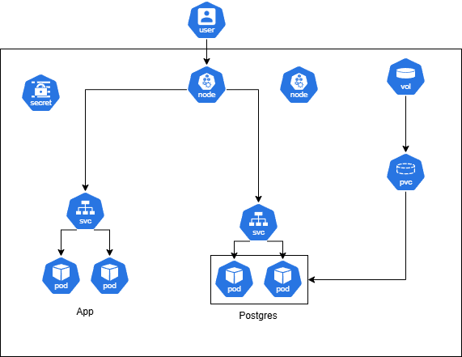

# Current System Problems

2.1 What is the problem?

There is only one pod, so if the pod goes down the application will not be available until a new one is recreated.

The PostgreSQL database should run in another pod for better security and persistence.

Without readiness and liveness probes, the reliability of the pod is not guaranteed.

There are no resource limits, which can cause errors or allow the pod to use too many resources.

The secrets are stored in plain text, which is not secure and is not the best way to handle sensitive data.

2.2 Why does it matter?

It matters because the production system is not secure or reliable. If something breaks, the system could go down completely.

The company could lose data and the application could remain unavailable for a long time, with no automatic recovery.

2.3 What failure or operational risk could it cause?

Running PostgreSQL inside the same pod can lead to data loss. There is no persistent storage, so if the pod is deleted, the data may disappear. Data is very important for an application, so this is a major risk.

Without readiness and liveness probes, the application could be down without anyone noticing, which could leave the service unavailable for a long time.

# Production Architecture

# Operational Strategy

4.1 How does the system scale?

The application runs in a Kubernetes Deployment with multiple replicas. A Kubernetes Service distributes traffic between pods. A Horizontal Pod Autoscaler can automatically add or remove pods based on CPU or memory usage to handle increased traffic.

4.2 How are updates deployed safely?

Updates use a rolling update strategy. Kubernetes gradually replaces old pods with new ones, ensuring the application stays available. If a new version fails readiness checks, the rollout can be paused or rolled back.

4.3 How are failures detected?

Failures are detected using liveness and readiness probes. Liveness probes restart unhealthy containers, while readiness probes prevent traffic from reaching pods that are not ready.

4.4 Which Kubernetes controllers handle recovery?

ReplicaSet

# Weakest Point

The weakest part of the architecture is the PostgreSQL database.

Even if the application can scale with multiple replicas, the database is still a single component that all pods depend on. If the database fails, the application will not be able to read or write data.

Under heavy traffic, the database could also become a bottleneck because all application replicas send queries to it.

In a more advanced production system, this could be improved with database replication, backups, or a managed database service.